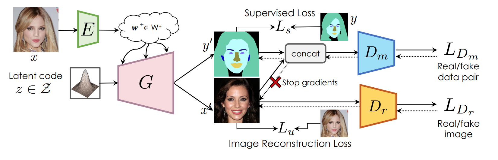
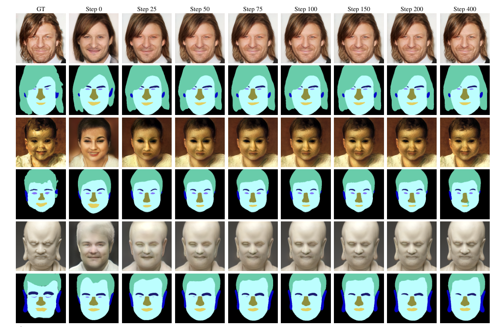

# SemanticGAN
This is the official code for:

#### Semantic Segmentation with Generative Models: Semi-Supervised Learning and Strong Out-of-Domain Generalization

[Daiqing Li](https://scholar.google.ca/citations?user=8q2ISMIAAAAJ&hl=en), [Junlin Yang](https://scholar.google.com/citations?user=QYkscc4AAAAJ&hl=en), [Karsten Kreis](https://scholar.google.de/citations?user=rFd-DiAAAAAJ&hl=de), [Antonio Torralba](https://groups.csail.mit.edu/vision/torralbalab/), [Sanja Fidler](http://www.cs.toronto.edu/~fidler/)

CVPR 2021 **[[Paper](https://arxiv.org/abs/2104.05833)]  [[Supp](https://nv-tlabs.github.io/semanticGAN/resources/SemanticGAN_supp.pdf)] [[Page](https://nv-tlabs.github.io/semanticGAN/)]** 




## Requirements
- Python 3.6 or 3.7 are supported.
- Pytorch 1.4.0 + is recommended.
- This code is tested with CUDA 10.2 toolkit and CuDNN 7.5.
- Please check the python package requirement from [`requirements.txt`](requirements.txt), and install using
```
pip install -r requirements.txt
```
## Dataset
We recently release MetFaces40 annotation we use as out-of-domain testing. Please notice this dataset is under the [Creative Commons BY-NC 4.0](https://creativecommons.org/licenses/by-nc/4.0/) license by NVIDIA Corporation. To view a copy of this license, visit [LICENSE](https://github.com/nv-tlabs/semanticGAN_code/blob/main/LICENSE). Please see [GDrive](https://drive.google.com/drive/folders/1ibZzaWSUVoQ94OPoLNS0FrUufBeDvRP4?usp=sharing).
## Training 

To reproduce paper **Semantic Segmentation with Generative Models: Semi-Supervised Learning and Strong Out-of-Domain Generalization**: 

1. Run **Step1: Semantic GAN training**
2. Run **Step2: Encoder training**
3. Run **Inference & Optimization**.  


---
#### 0. Prepare for FID calculation
In order to calculate FID score, you need to prepare inception features for your dataset,

```
python prepare_inception.py \
--size [resolution of the image] \
--batch [batch size] \
--output [path to save the inception file, in .pkl] \
--dataset_name celeba-mask \
[positional argument 1, path to the image folder]] \
```
#### 1. GAN Training

For training GAN with both image and its label,

```
python train_seg_gan.py \
--img_dataset [path-to-img-folder] \
--seg_dataset [path-to-seg-folder] \
--inception [path-to-inception file] \
--seg_name celeba-mask \
--checkpoint_dir [path-to-ckpt-dir] \
```

To use multi-gpus training in the cloud,

```
python -m torch.distributed.launch \
--nproc_per_node=N_GPU \
--master_port=PORTtrain_gan.py \
train_gan.py \
--img_dataset [path-to-img-folder] \
--inception [path-to-inception file] \
--dataset_name celeba-mask \
--checkpoint_dir [path-to-ckpt-dir] \
```

#### 2. Encoder Triaining

```
python train_enc.py \
--img_dataset [path-to-img-folder] \
--seg_dataset [path-to-seg-folder] \
--ckpt [path-to-pretrained GAN model] \
--seg_name celeba-mask \
--enc_backboend [fpn|res] \
--checkpoint_dir [path-to-ckpt-dir] \
```

## Inference

For Face Parts Segmentation Task


```
python inference.py \
--ckpt [path-to-ckpt] \
--img_dir [path-to-test-folder] \
--outdir [path-to-output-folder] \
--dataset_name celeba-mask \
--w_plus \
--image_mode RGB \
--seg_dim 8 \
--step 200 [optimization steps] \
```

Visualization of different optimization steps




## Citation 

Please cite the following paper if you used the code in this repository.

```
@inproceedings{semanticGAN, 
title={Semantic Segmentation with Generative Models: Semi-Supervised Learning and Strong Out-of-Domain Generalization}, 
booktitle={Conference on Computer Vision and Pattern Recognition (CVPR)}, 
author={Li, Daiqing and Yang, Junlin and Kreis, Karsten and Torralba, Antonio and Fidler, Sanja}, 
year={2021}, 
}
```


## License 
For any code dependency related to Stylegan2, the license is under the Nvidia Source Code License-NC. To view a copy of this license, visit https://nvlabs.github.io/stylegan2/license.html

The work SemanticGAN is released under MIT License.

```
The MIT License (MIT)

Copyright (c) 2021 NVIDIA Corporation. 

Permission is hereby granted, free of charge, to any person obtaining a copy of
this software and associated documentation files (the "Software"), to deal in
the Software without restriction, including without limitation the rights to
use, copy, modify, merge, publish, distribute, sublicense, and/or sell copies of
the Software, and to permit persons to whom the Software is furnished to do so,
subject to the following conditions:

The above copyright notice and this permission notice shall be included in all
copies or substantial portions of the Software.

THE SOFTWARE IS PROVIDED "AS IS", WITHOUT WARRANTY OF ANY KIND, EXPRESS OR
IMPLIED, INCLUDING BUT NOT LIMITED TO THE WARRANTIES OF MERCHANTABILITY, FITNESS
FOR A PARTICULAR PURPOSE AND NONINFRINGEMENT. IN NO EVENT SHALL THE AUTHORS OR
COPYRIGHT HOLDERS BE LIABLE FOR ANY CLAIM, DAMAGES OR OTHER LIABILITY, WHETHER
IN AN ACTION OF CONTRACT, TORT OR OTHERWISE, ARISING FROM, OUT OF OR IN
CONNECTION WITH THE SOFTWARE OR THE USE OR OTHER DEALINGS IN THE SOFTWARE.
```