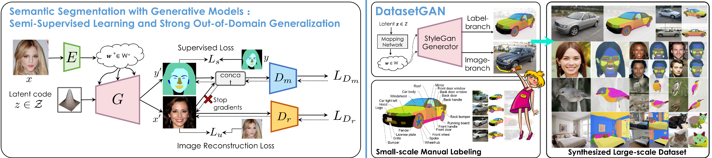

# Semantic Segmentation GAN

Official Repository for

Semantic Segmentation with Generative Models: Semi-Supervised Learning and Strong Out-of-Domain Generalization (**CVPR'21**)

[paper](https://arxiv.org/abs/2104.05833)  [supplementary](https://nv-tlabs.github.io/semanticGAN/resources/SemanticGAN_supp.pdfg)

In this paper, we utilize the GAN as the inference network via test-time optimization. datasetGAN is faster at test time and can handle less training data, while semGAN shows very strong performance on out-of-distribution data.

## Requirements
- Python 3.6 or 3.7 are supported.
- Pytorch 1.4.0 + is recommended.
- This code is tested with CUDA 10.2 toolkit and CuDNN 7.5.
- Please check the python package requirement from [`requirements.txt`](requirements.txt), and install using
```
pip install -r requirements.txt
```

## Training 

To reproduce paper **Semantic Segmentation with Generative Models: Semi-Supervised Learning and Strong Out-of-Domain Generalization**: 

*Download Pretrained checkpoint from [google drive](https://drive.google.com/drive/folders/1cgzik55OyVwlHIjj2f2HtMngGKORBlCn?usp=sharing)*

1. Run **Step1: Semantic GAN training**
2. Run **Step2: encoder training**
3. Run **Inference & Optimization**.  


---

#### 1. GAN Training

For training GAN with both image and its label,

```
python train_seg_gan.py \
--img_dataset [path-to-img-folder] \
--seg_dataset [path-to-seg-folder] \
--inception [path-to-inception file] \
--seg_name celeba-mask \
--checkpoint_dir [path-to-ckpt-dir] \
```

Pretrain checkpoints at [google drive](https://drive.google.com/drive/folders/1cgzik55OyVwlHIjj2f2HtMngGKORBlCn?usp=sharing)

To use multi-gpus training in the cloud,

```
python -m torch.distributed.launch \
--nproc_per_node=N_GPU \
--master_port=PORTtrain_gan.py \
train_gan.py \
--img_dataset [path-to-img-folder] \
--inception [path-to-inception file] \
--dataset_name celeba-mask \
--checkpoint_dir [path-to-ckpt-dir] \
```

#### 2. Encoder Triaining

```
python train_enc.py \
--img_dataset [path-to-img-folder] \
--seg_dataset [path-to-seg-folder] \
--ckpt [path-to-pretrained GAN model] \
--seg_name celeba-mask \
--enc_backboend [fpn|res] \
--checkpoint_dir [path-to-ckpt-dir] \
```

## Inference

Inference for ***Semantic Segmentation with Generative Models: Semi-Supervised Learning and Strong Out-of-Domain Generalization***

1. For Face Parts Segmentation Task


```
python inference.py \
--ckpt [path-to-ckpt] \
--img_dir [path-to-test-folder] \
--outdir [path-to-output-folder] \
--dataset_name celeba-mask \
--w_plus \
--image_mode RGB \
--seg_dim 8 \
--step 200 [optimization steps] \
```

2. For Chest X-ray Segmentation Task,


```
python inference.py \
--ckpt [path-to-ckpt] \
--img_dir [path-to-test-folder] \
--outdir [path-to-output-folder] \
--dataset_name cxr \
--w_plus \
--image_mode L \
--seg_dim 1 \
--step 200 [optimization steps] \
```

3. For Skin Lesion Segmentation Task,


```
python inference.py \
--ckpt [path-to-ckpt] \
--img_dir [path-to-test-folder] \
--outdir [path-to-output-folder] \
--dataset_name skin \
--w_plus \
--image_mode RGB \
--seg_dim 1 \
--step 200 [optimization steps] \
```


